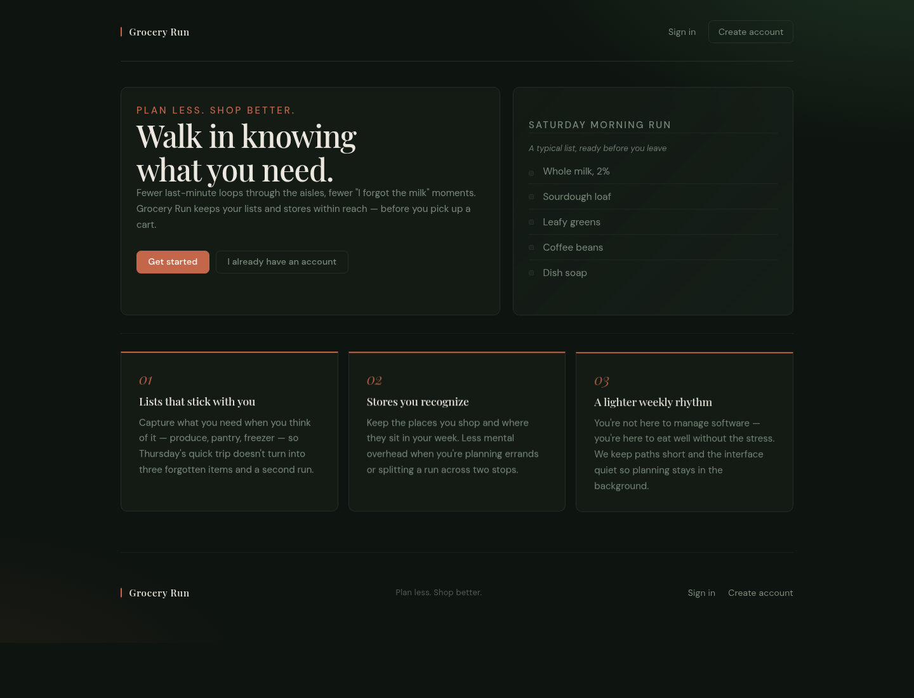

# Grocery Run

> **Archived collaborative project (2026).** Grocery Run is preserved as a historical portfolio artifact and is not actively maintained. The hosted Railway deployment has been retired.

Grocery Run is a full-stack grocery planning application built with Spring Boot. It combines personal grocery lists with structured store layouts, allowing a list to be translated into aisle-by-aisle stops for a selected store.



## What it demonstrates

- A layered Spring application using controllers, services, repositories, entities, and DTOs
- Server-rendered Thymeleaf pages backed by JSON endpoints
- PostgreSQL persistence through Spring Data JPA and Hibernate
- Form login, BCrypt password hashing, CSRF protection, and role-based authorization
- User-owned grocery lists with item management and JSON import/export
- Administrative modeling of stores, locations, aisles, categories, and products
- Route generation that matches list items to a store's aisle/category layout
- Service-level unit tests using JUnit 5 and Mockito
- Docker Compose for local PostgreSQL development

## System shape

```text
Browser
  │
  ├── Thymeleaf pages and browser-side JavaScript
  │
  ▼
Spring MVC controllers and REST endpoints
  │
  ▼
Services → DTO mappers → JPA repositories
  │
  ▼
PostgreSQL
```

## Product areas

- **Accounts:** Register, sign in, update account details, and delete an account.
- **Grocery lists:** Create lists, add or remove products, rename lists, and import/export list data.
- **Store layouts:** Model store locations, owners, aisles, categories, and item placement.
- **Shopping routes:** Match a grocery list against a store layout and return ordered aisle stops plus unmatched items.
- **Administration:** Restrict store-layout and user-management operations to administrators.

## Historical reproduction

There is no live demo. The former Railway deployment is unavailable.

### Requirements

- JDK 21
- Docker with Docker Compose

### Local setup

1. Create a local environment file and replace the placeholder password:

   ```bash
   cp .env.example .env
   ```

   The `DB_NAME` and `DB_PORT` values must match the database name and port in `SPRING_DATASOURCE_URL` if you customize them.

2. Start PostgreSQL:

   ```bash
   docker compose up -d
   ```

3. Export the same datasource settings for Spring Boot and start the application:

   ```bash
   set -a
   . ./.env
   set +a
   ./mvnw spring-boot:run
   ```

4. Open <http://localhost:8080>.

Stop the database with `docker compose down`. Use `docker compose down -v` if you also want to remove its local data volume.

### Tests

The service-level unit suite does not require PostgreSQL:

```bash
./mvnw -Dtest='!AppApplicationTests' test
```

`AppApplicationTests` loads the complete Spring context and therefore requires a separately configured PostgreSQL test database.

## Historical limitations

- The original hosted deployment is retired.
- The dependency snapshot is frozen and should be audited before any new deployment.
- Hibernate uses `ddl-auto=update`; the repository does not contain production database migrations.
- Most automated coverage is concentrated in service-layer unit tests rather than browser or full integration tests.
- This repository should be treated as a learning and portfolio snapshot—not maintained production software.

## Project context and attribution

Grocery Run was developed collaboratively by [@itsreverence](https://github.com/itsreverence), [@Marcos-818](https://github.com/Marcos-818), [@EricWade13](https://github.com/EricWade13), and [@Janielh-Ocasla](https://github.com/Janielh-Ocasla). The repository history preserves the implementation and collaboration record.

## License

Grocery Run is available under the [MIT License](LICENSE). The repository owner confirmed that the copyright contributors authorized this repository-wide license.
